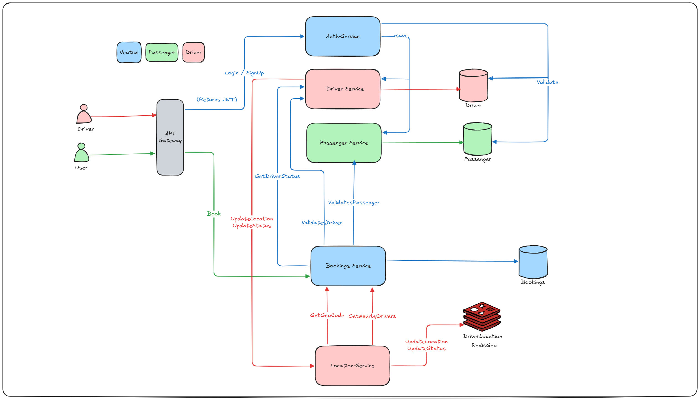

# RideNow-Microservices
🚗 Built a Real-Time Ride Booking System – *RideNow*

I developed a microservices-based ride booking platform with real-time capabilities.

System Design:

🔧 Key Features:
• Microservices architecture using Spring Boot
• Real-time driver location tracking with Redis
• Location-based driver discovery using Redis GEO queries
• Ride matching system between users & drivers
• JWT-based authentication with Spring Security
• API Gateway for centralized request handling
• OpenFeign for inter-service communication

💡 A key learning was implementing real-time location tracking and efficiently finding nearby drivers using GEO queries — making the system fast and scalable.

This project strengthened my skills in:
→ Real-time systems
→ Distributed architecture
→ Backend scalability
→ Concurrency handling

#BackendEngineer #Microservices #Java #SpringBoot #SystemDesign #Redis #RealTimeSystems
